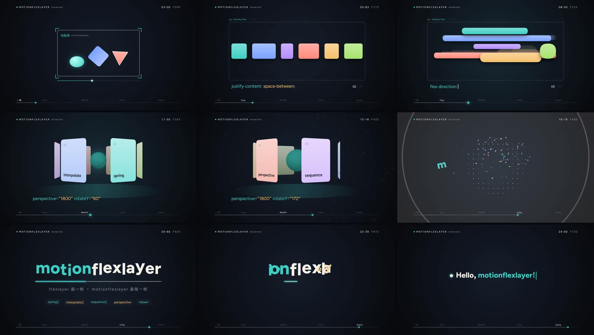

# motionflexlayer

The motion counterpart of [flexlayer](https://github.com/ruochi/flexlayer).

Work in progress.

## Showreel

[`showreel/showreel.mp4`](showreel/showreel.mp4) — 25.5 s, 1920×1080, 30 fps, with music and sound effects.



Every frame is a flexlayer tree written in TSX and rendered by `@dc/flexlayer`. The music and every sound effect are synthesised in TypeScript (`showreel/audio/`), no samples. Picture and sound read the same clock in [`showreel/timeline.ts`](showreel/timeline.ts): 120 BPM at 30 fps puts every beat on frame 15n, and each pop, whoosh and key click is scheduled on the frame of the motion that causes it.

| Section | Frames | What moves |
| --- | --- | --- |
| 一帧 | 0–119 | A dot, a traced frame and three shapes; the playhead wakes them up, then the camera pushes into the square |
| flex | 120–299 | Six items move through six CSS states. Yoga computes each state (`checkFvg` reports the boxes) and a spring carries the items between them, with squash and stretch along the direction of travel |
| depth | 300–479 | The same items fold into a `perspective` ring, step on every second beat, then wind up into the drop |
| title | 480–659 | Impact, then the title letters spring in one by one; positions come from a flex row laid out by Yoga |
| hello | 660–764 | The title collapses into a dot that types `Hello, motionflexlayer!` |

Render it (needs `ffmpeg` on `PATH`):

```bash
npm install
npm run showreel                                   # showreel/out/showreel.mp4 + .wav
npx tsx showreel/render.tsx --stills 90,345,620 --scale 0.5
npx tsx showreel/render.tsx --audio-only
```

The renderer prints flexlayer's report for every frame. Issues the choreography wants on purpose (the camera push leaving the canvas, letters overlapping while they spring in) are listed with their frame ranges in `showreel/render.tsx`; anything else at error level fails the render.

## JSX

`tsconfig.json` sets `"jsxImportSource": "motionflexlayer"`. [`src/jsx-runtime.ts`](src/jsx-runtime.ts) wraps flexlayer's `h()` and adds what its own JSX runtime does not have yet: function components, fragments and `JSX` types. `draw={(ctx, el) => …}` stays a real closure, so a component can read the current frame.

```tsx
function Dot({ f }: { f: number }) {
  return <circle cx={960} cy={540} r={10 + 4 * Math.sin(f / 5)} fill="#3ecfc4" />
}
```

## Development

`@dc/flexlayer` is installed from git at a pinned commit and compiled by `postinstall`.

```bash
npm start          # Hello, motionflexlayer!
npm run typecheck
```
